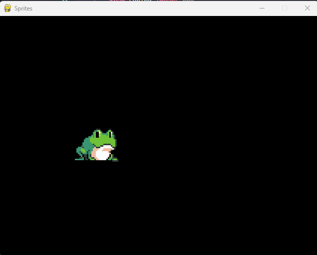

# Sapo mostrando a lingua

 *Jogo feito em Python no Curso Pygame - Sprites*
 
***
  

***
## *Agradecimento*
Gostaria de agradecer ao João Tinti, por fazer o curso de Jogos e por transmitir o conhecimento adiante, muito obrigado!
Aprendi muito desenvolvendo esse jogo iterativo.

***
